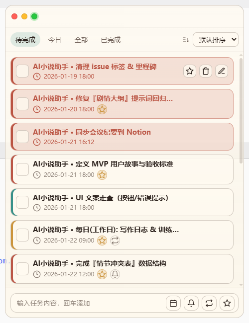
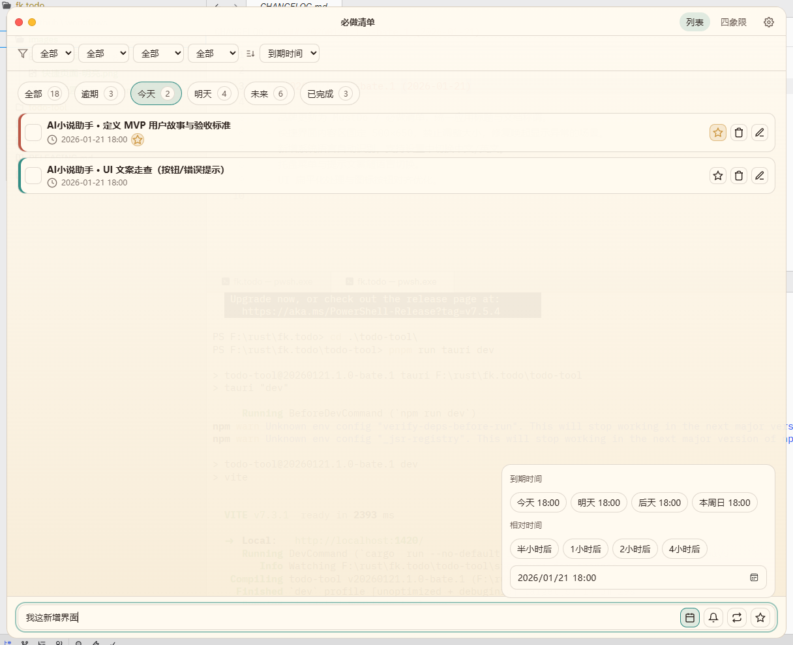
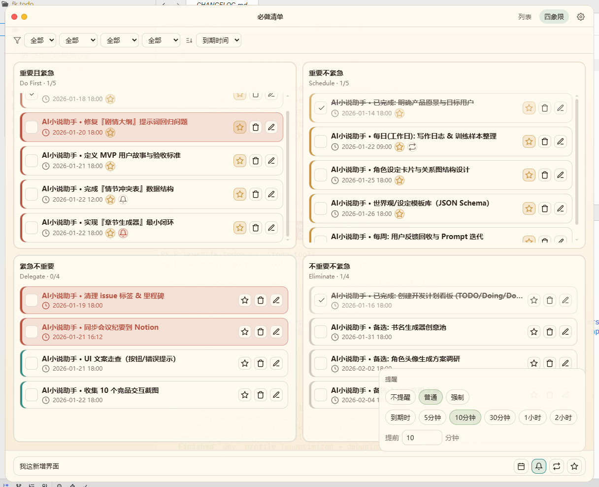
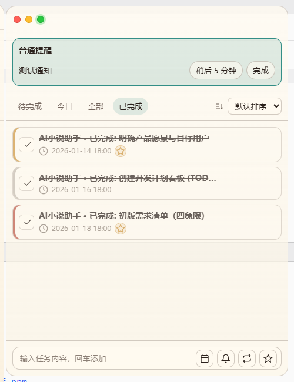
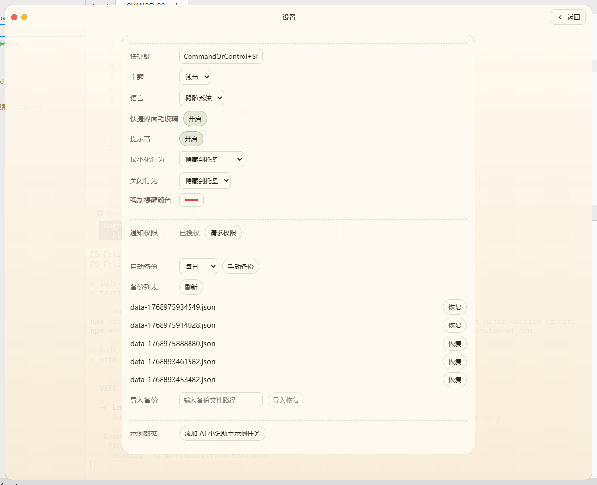

# 必做清单 MustDo

[English](README.md) | 中文

## 下载（先看这里）

请前往本项目的 Releases 下载适合你系统的安装包（Windows / macOS / Linux）：

- Releases：`../../releases`
- 或替换为你的仓库地址：`https://github.com/你的组织/你的仓库/releases`

版本更新说明：`CHANGELOG.md`

## MustDo 是什么？

MustDo（必做清单）是一款「桌面级 Todo 工具」：主打快速记录、始终可见，以及在关键时刻“强提醒”。

- 快速记录：几秒钟把想法变成可执行的任务
- 桌面友好：更适合常驻与随时查看的日常节奏
- 强提醒：对“必须做”的事更坚定、更不容易被忽略
- 简单顺手：不折腾流程，把注意力留给行动

以下截图为浅色主题示例。

## 界面速览

快捷窗口：随时弹出，适合快速添加与查看今日任务。

列表视图：按时间分组，让一天的计划更清晰。

四象限视图：按重要/紧急整理优先级，下一步更好选。

强提醒：为“不能拖”的事情准备的提醒方式。

普通提醒：以系统通知的方式出现，轻量但到位。

设置：快捷键、提醒、语言、备份等选项可按习惯调整。

## 初衷

很多 Todo 应用擅长“收纳”，但不一定擅长“推动你去做”。
MustDo 的目标很简单：更贴近桌面使用场景，让任务更容易被看见、更容易被执行；当你真的需要被提醒时，它也更认真。

## 技术（只说一句）

使用 Tauri v2（Rust）+ React + TypeScript（Vite），追求轻量、流畅、跨平台。

## 贡献

欢迎一起把 MustDo 打磨得更好：

- 反馈问题/想法：直接提 Issue，描述现象或使用场景
- 代码贡献：欢迎 PR，建议小步、聚焦，便于快速合并
- 开发/协作说明：`AGENTS.md`、`todo-tool/AGENTS.md`、`todo-tool/src-tauri/AGENTS.md`

